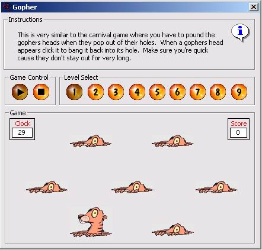



## Gopher game \(Not the protocol\)

### Description

A Game just like the gopher one you play at carnivals. Just bash the gopher on the head and get a point.
 
### More Info
 

             |
---                |---
**Submitted On**   |2002-08-02 13:33:10
**By**             |[Matt Vincent](https://github.com/Planet-Source-Code/PSCIndex/blob/master/ByAuthor/matt-vincent.md)
**Level**          |Beginner
**User Rating**    |5.0 (15 globes from 3 users)
**Compatibility**  |VB 6\.0
**Category**       |[Games](https://github.com/Planet-Source-Code/PSCIndex/blob/master/ByCategory/games__1-38.md)
**World**          |[Visual Basic](https://github.com/Planet-Source-Code/PSCIndex/blob/master/ByWorld/visual-basic.md)
**Archive File**   |[Gopher\_gam1226538262002\.zip](https://github.com/Planet-Source-Code/matt-vincent-gopher-game-not-the-protocol__1-38318/archive/master.zip)

